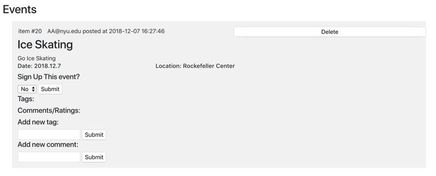
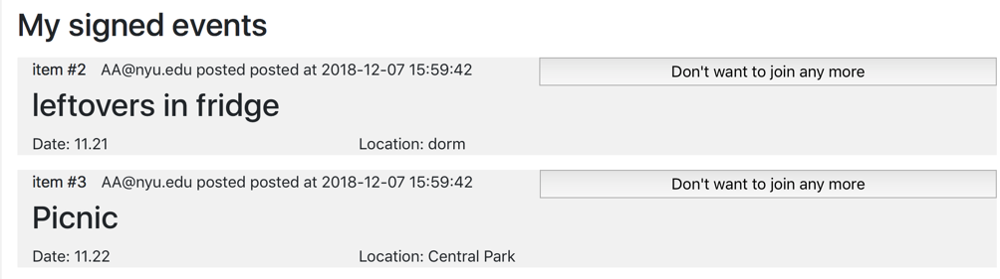

# PriCoShare

A forum where people can share events. 

## Use Cases

Before logging in, users are able to:

* View public events within the past 24 hours
* Log in

After logging in, a user is able to:

* Logout
* At Homepage
  * View information of events that are public or shared with them within the past 24 hours, including event description, event date and event location. 
  * View the names of tagged friends, ratings, and comments.
  * Sign up for events.
  * Tag friends under events that are visible to them. The names of tagged friends would not be shown until they have accepted it.
  * Add comments.
  * Delete events that the user posted.
* At Post page
  * Post events to public or to selected friend groups that the user belongs to.
* At Tag page
  * Manage tags by accepting or declining tags.
* At Friend group page
  * View friend groups that they own.
  * Add friends to an existing friend group. 
* At Event page
  * View events that the user has signed up.
  * Cancel events that the user has signed up.

## Details of Optional Use Cases

1. Add comments
  * Description: Users are able to comment under events that are visible to them, and one person can only comment once for an event.
  * Reason for adding: Comments under an event would help the users who have not yet signed up have a better understanding about the event.
  * Database modification: Rate table used, not modified.
  * Source code: [app.py 263-280](app.py)

2. Show event date and event location
  * Description: Users are able to view event date and event location.
  * Reason for adding: Importatnt information about events.
  * Database modification: [ContentItem table modified.](sql/ProjTableDefs.sql)

3. Sign up for events
  * Description: Users are able to sign up for events.
  * Reason for adding: Allows users to sign up for events they are interested in conveniently.
  * Database modification: [Signup table added.](sql/ProjTableDefs.sql)
  * Source code: [app.py 202-216](app.py)

4. View and manage signed-up events
  * Description: Users are able to view events they have signed up for and to cancel events.
  * Reason for adding: Allows users to manage the events, improves user experience.
  * Database modification: None.
  * Source code: [app.py 238-260](app.py)

5. Delete events posted
  * Description: Users are able to delete the events they posted. Once an event is deleted, all related information including its tags, ratings and comments will be deleted. Users who have signed up for the event will also be automatically removed.
  * Reason for adding: Allows users to manage the events they posted, improves user experience.
  * Database modification: None.
  * Source code: [app.py 219-235](app.py)

Example for optional use case 1, 2, 3, 5:

Example for optional use case 4:

## Contribution

* Anqi Luo: login, view public events, view shared events and detailed info, tag an event, manage tags
* Ting Luo: view shared events and detailed info, post a event, sign up for events, delete posted events, view and manage signed-up events
* Yutong Liu: add friend, add comments
